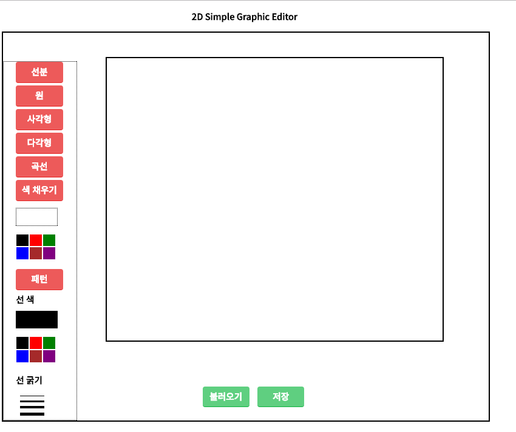
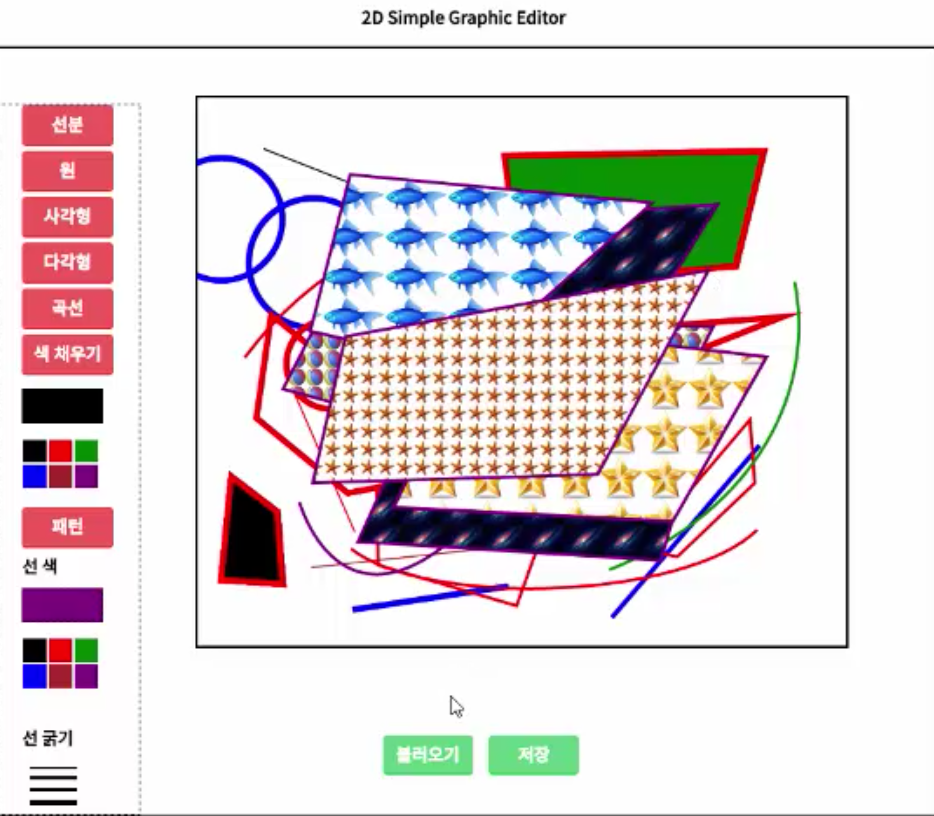
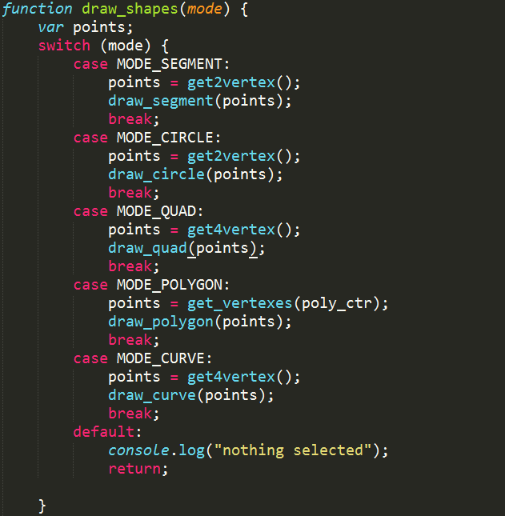
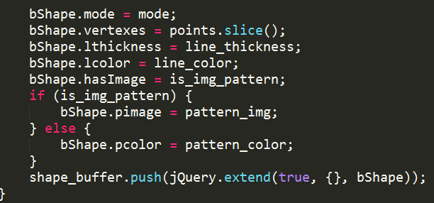
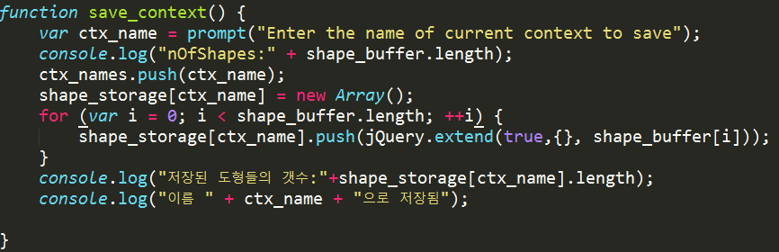
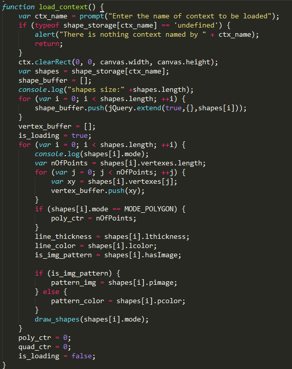

# 2D Simple Graphic Editor
[toc]
## 1. 개요
본 문서는 부산대학교 2016년도 2학기 컴퓨터그래픽스 과목에서 과제로 주어진 2D Simple Graphic Editor에 대한 소개이다. 웹 브라우저 상에서 캔버스를 활용해 구현된 이 프로그램은 제목 그대로 단순한 2d 그래픽 에디터이다. 그릴 수 있는 도형은 직선, 원, 사각형, 다각형, 곡선이다. 선 색상과, 굵기도 지정할 수 있다. 그리고 사각형 안에 원하는 그림을 반복된 패턴으로 채워넣을 수도 있다.  
  
[과제 소개](PA01.pdf)  

PA01.pdf 과제의 모든 점검사항과 도전 과제를 구현하였다. 도전 과제의 1번은 이 문서의 마지막 절에서 다루고 2, 3번은 6절과 7절의 시연 영상에서 확인할 수 있다. [여기](2DSimpleGraphicEditor_submit.html)에서 직접 확인할 수도 있다.

## 2. 인터페이스와 기능
인터페이스 구성은 다음 그림과 같다. 먼저, 왼쪽 패널엔 그릴 수 있는 도형을 버튼을 클릭하여 선택할 수 있고, 다각형 같은 경우에는 채울 색상과, 그림 패턴을 고를 수 있다. 선 색과 굵기도 조정할 수 있고 그리는 모든 도형에 대해 적용된다. 원하는 도형을 선택하고 나서, 마우스를 이용하여 html 캔버스로 구현된 가운데 상자에 도형을 그릴 수 있다. 만약 현재 저장된 그림을 일시적으로 저장하기 위해서 아랫쪽의 저장 버튼을 클릭하여 저장할 이름을 지정한다. 나중에 다시 불러오기 위해서는 불러오기 버튼을 클릭하여 해당 이름을 넘겨준다. 처음시작 후, 어떠한 버튼도 선택하지 않으면 아무것도 그려지지 않는다. 버튼의 CSS이미지는 [50 CSS3 button example](https://www.sanwebe.com/2014/02/css3-buttons-examples-with-effects-animations)에서 한 가지를 사용해서 조금 조절하였다.

## 3. 도형 그리기
그릴 수 있는 도형은 선분, 원, 사각형, 다각형, 곡선이다. 각 도형별로 필요한 정점의 수가 다르다. 선분은 2점(시작점과 끝점), 원도 2점(중점, 반지름), 사각형은 4점, 다각형은 n(n>3), 곡선은 베지어 곡선으로 4개의 점이 필요하다. 이때 다각형의 정점의 갯수가 n = 4이면 사각형과 같다. 도형마다 필요한 정점의 수가 다르다 보니 마우스로 이들 정점을 구하는 방법에도 약간의 차이가 존재한다. 다음은 각 도형별로 그리는 방법을 소개한다.

|도형 | 정점 갯수|
|:----:|:----:|
|선분 | 2|
|원 |  2|
|사각형 | 4|
|다각형 | n>3|
|곡선 | 4|

#### 선분
캔버스에 놓여진 마우스 커서에 왼쪽 버튼을 클릭하면 시작 정점이 되고 드래그를 하여 마우스를 뗀 지점이 끝 정점이 되어 선분이 그려진다. 기본 선 색상과 굵기는 각각 검은색, 2px이다. 선에 대한 기본 값은 이후 모든 도형에 적용된다.

#### 원
선분과 마찬가지로 그리는데, 왼쪽 버튼을 클릭할 때의 지점이 원의 중심이 되고 드래그 후, 뗀 지점과 중점 사이의 거리가 반지름이 되어 원이 그려진다. 문제 요구 조건에 의해 원은 색상을 가지지 않는다.

#### 사각형
사각형은 4개의 정점을 필요로 한다. 따라서 마우스 왼쪽 버튼을 클릭하여 캔버스 위의 4개의 지점을 정하면, 자동으로 사각형이 그려진다. 사각형은 다른 도형과는 다르게 왼쪽 패널의 패턴 버튼과 상호작용이 가능하다. 패턴 버튼을 클릭하여 같은 디렉토리의 사진을 지정해주면[^1] 이후 사각형을 그릴 때 내부에 사진이 반복된 패턴으로 채워진다.

#### 다각형
다각형은 3개 이상의 정점을 가지는 도형으로, 삼각형, 사각형, 오각형, 육각형, ... , n각형을 그릴 수 있다. 따라서 정점의 갯수를 지정해주어야 한다. 왼쪽 버튼으로 정점의 위치와 갯수를 지정해준 뒤, 마우스 오른쪽 버튼을 클릭하면 다각형이 그려진다. 문제 요구 조건에 의해 다각형은 색상을 가지지 않는다.

#### 곡선
구체적으로, 3차 베지어 커브를 그린다. 4개의 점을 받는데, 첫 점은 곡선의 시작점, 이후 두 개의 점은 컨트롤 포인트, 마지막 점은 곡선의 끝점으로 정하고 곡선을 그린다.

## 4. 선의 색상과 두께 설정하기
앞에서 도형을 어떻게 그리는지 설명했다. 도형은 정점이 정해지면 정점 사이를 선으로 이어서 연결한다. 이때 선의 색상과 두께, 넓이를 가지는 도형의 경우(여기에서는 사각형) 채울 색상을 정할 수 있다. 선의 색상은 검은색, 빨강색, 초록색, 파란색, 갈색, 보라색 중 하나를 선택할 수 있다. 선의 두께는 2px, 4px, 6px, 8px 중 하나를 선택할 수 있다. 선의 색상과 두께의 기본 값은 각각 검은색, 2px이다. 색상과 두께를 선택하고 나면 이후에 그려지는 모든 도형에 대해 적용된다.
넓이를 가지는 도형은 원, 사각형, 다각형이고 이들은 내부 색상을 가진다. 문제 요구 조건에 의해 이 중에서 사각형만 색상 지정이 가능하다. 기본 색은 아무런 색도 지정되지 않았다. 색상을 채우기 위해서는, 먼저 도형을 그리고, 원하는 색상을 선택한 뒤 색 채우기 버튼을 클릭한다. 현재 선택된 색상은 색 채우기 버튼 밑의 점선으로 그려진 상자 안에 나타난다.

## 5. 패턴
캔버스는 그림으로 도형 내부를 반복적인 패턴으로 채울 수 있는 기능이 있다. 패턴 버튼을 클릭하면, 현재 디렉토리에서 원하는 이미지를 클릭할 수 있다. 이 프로그램에서 샘플로 사용하는 이미지의 파일 명은 각 ball, cosmos, fish, star, starfish이다. 아래 그림 목록에 이미지가 순서대로 나와있다.

1. 
2. 
3. 
4. 
5. 

## 6. 저장과 불러오기
도형을 얼마간 그리고 나서 저장 버튼을 누르면 이름을 요구하는 창이 뜬다. 예를 들어 x라고 입력하자. 그러고 나서 그림을 또 얼마간 그린 후 이전에 x를 저장할 당시에 그렸던 그림을 불러오고 싶다면 불러오기 버튼을 클릭하여 x라고 입력한다. 저장하는 방식은 파일을 영구적으로 로컬 디스크에 저장하는 식이 아니라, 현재 할당받은 메모리에 일시적으로 저장하는 방식이다. 따라서 브라우저를 종료하거나 새로고침을 하게 되면 기존의 저장된 내용은 사라지게 된다.[^2]

## 7. 시연 영상
<iframe width="640" height="360" src="https://www.youtube.com/embed/hzQj2XMC5y4" frameborder="0" allowfullscreen></iframe>

시연 화면

## 8. 도전 과제 1번(그려진 모든 객체를 표현할 수 있는 양식) 그리고 저장하기와 불러오기
이전 절들에서는 프로그램의 기능적 측면에 초점을 맞추었지만 이 절에서는 문제에서 요구하는 설명을 하기 위해 프로그램의 내부 구현에 초점을 맞춘다. 코드의 모든 부분을 논의할 수는 없기 때문에 중요한 몇 부분만 요약하여 설명한다. 문제의 질문을 다시 풀어 쓰면 다음과 같을 것이다. **주어진 도형을 어떻게 일관되게 표현하고 그릴 것인가**? 즉 그려진 모든 객체를 표현할 수 있는 양식이라는 말의 의미는 **각 객체를 추상화하여 일관된 양식으로 표현**하는 것이다. 몇 번의 고민 후에 필자가 제안한 양식은 다음의 사실에 기초한다.

- 모든 정점은 선으로 이어진다
- 모든 선은 색상과 굵기를 가진다
- 선으로 둘러싸인 도형은 색상을 가진다
- 모든 객체(여기서는 도형)은 모두 정점과 선과 넓이로 이루어져 있다

위 사실 중 4번째에서 선과 곡선은 수학적으로 넓이가 정의되지 않았다고 할 수 있지만, 컴퓨터 언어적로 말하면 단순히 넓이가 0인 도형일 뿐이다. 원칙적으로는 원과, 다각형과 넓이를 가지기 때문에 안에 색상을 채울 수 있지만 문제 요구에 의해 보류하게 되었다. 즉 이 프로그램에서는 사각형만 색상 지정이 가능하다.

이를 바탕으로 도형 객체를 다음과 같이 추상화 시키고자 한다.

1. 유형(선분, 원, 사각형, 다각형, 곡선)
2. 정점의 위치 집합(정점 배열)
3. 선의 굵기
4. 선의 색상
5. 내부 색상 또는 이미지

위와 같이 정의하면 어떤 도형이더라도 그 도형의 유형에 따라 정점을 몇 개 택할 것인지, 선의 굵기와 색상, 내부를 채우는 색상 또는 이미지와 같이 도형 객체를 일관된 방식으로 표현할 수 있다.

### 도형 객체 추상화의 활용예

그럼 코드 부분을 살펴보면서 추상화의 이점을 알아보자. draw_shapes 함수는 입력으로 도형의 모드(또는 유형)를 받아서 각 도형을 그려주는 함수를 호출해주는 함수이다. 입력에 따라 draw_segment, draw_circle, draw_quad, draw_polygon, draw_curve를 호출한다. 이때 호출 전에 getvertex() 함수가 호출되는데 이는 마우스로 정점의 위치를 잡아주면 정점은 **정점 버퍼(Vertex Buffer)**에 들어가게 되는데 여기에서 최근에 들어간 정점 중 필요한 수 만큼 값을 돌려준다. 예를 들어, 선분, 원은 정점이 2개가 필요하므로 get2vertex()를 호출하고, 사각형과 곡선은 4개가 필요하므로 get4vertex()를 호출하여 4개를 받아 넘겨준다. 여기서 중요한 사실은 다각형의 경우이다. 다각형은 정점의 갯수가 사용자에 의존하기 때문에 현재까지 몇 개를 찍었는지 추적할 필요가 있다. 이는 poly_ctr 변수에 의해 카운트 된다. 따라서 그리기 전에 poly_ctr만큼 정점을 돌려줄 필요가 있다.

사실, 이 과제에서 도형 객체를 추상화 했을 때 가장 큰 이점을 본 것은 저장하기와 불러오기 기능을 구현할 때였다. 이 기능을 구현하려면 도형에 관한 여러 정보를 하나의 캡슐화된 객체로 저장하고 불러올 수 있는 것이 훨씬 개념적으로도 간단하고 구현하기에도 편하다. 여기서는 도형 하나하나가 그려질 때마다 도형 버퍼(shape buffer)에 넣어진다. 도형 버퍼는 배열인데 바로 위에서 기술한 도형 객체 하나가 배열의 원소이다. 아래 사진은 도형을 그리고 난 이후에 각 도형을 도형 버퍼에 넣는 과정을 보여준다. bShape는 그리기 함수가 그리기 바로 직전에 참조하는 도형 객체이다. 모든 그리기 함수는 bShape의 정보를 바탕으로 그리기 때문에, 그리기 이전에 이 객체의 정보를 채워야 한다.[^3] 코드의 마지막을 보면 jQuery.extend함수가 있다. 자바 스크립트에서 배열은 call by reference가 기본이다. 따라서 배열을 복사하기 위해서는 deep copy가 필요하다. 이를 지원해주는 함수가 jquery의 extend함수이다.

#### 저장하기(Save Context)
마지막으로 저장하기와 불러오기에서 추상화의 위력을 실감해보자. 아래 그림은 저장하기 버튼을 눌렀을 때의 수행하는 부분이다. 먼저 사용자로부터 이름을 요구한다. 이후 현재 그려진 모든 객체를 저장하기 위해 전역으로 정의된 shape_storage를 해쉬 처럼 사용하여 해당 이름에 해당하는 공간에 배열을 할당한다. 그리고 나서 위에서 언급한 shape_buffer에 기록된 모든 도형을 하나씩 복사해서 저장한다.

#### 불러오기(Load Context)
불러오기 함수가 조금 복잡한데, 이는 그리기 위한 모든 자료 구조가 새롭게 로드된 자료로 초기화 되어야 하기 때문이다. 먼저 불러올 컨텍스트 이름을 요구한다. 만약에 정의되지 않았다면 에러 메시지를 띄우고 종료한다. 그렇지 않으면 캔버스를 초기화 시키고 shape_storage에서 요구된 shape 객체 배열을 shape_buffer에 복사한다. 그런 후에 is_loading 을 true로 설정한다. 이는 그리는 작업이 마우스로 그리는 것과 지금과 같이 불러오기에 의해 그리는 작업을 구분해주기 위함이다. 다음의 for문에서는 shape_buffer(shapes)에 들어 있는 각 객체의 정보를 토대로 선 색상, 굵기, 정점 배열, 이미지, 패턴 등을 초기화해주고 하나씩 그려준다. 다 그린 이후에는 다각형, 사각형 정점 카운터를 초기화 시키고 로딩이 끝났음을 알려주는 is_loading을 false로 대입한다.

[^1]:html보안 정책 상 임의의 로컬 파일 위치를 읽을 수는 없다. 경로를 출력해보면 FakePath/file 라고 나온다.
[^2]: 웹 클라이언트 브라우저에서 기본적으로 보안 상의 이유로 파일 쓰기가 금지되어 있는 것 같다. HTML5 file API가 있기는 하지만 아직까지 완성된 단계는 아니고 draft 단계라고 한다. 이외에 파일을 쓸려면 node js와 같은 서버 측 환경에서 자바 스크립트를 써야 하는데 이는 서버 프로그래밍이므로 범위를 넘어간다. 또 브라우저에 종속적인 방법도 있다. IE는 악명 높은 액티브 X로 파일 쓰기가 가능하다. 크롬 브라우저도 별도의 API 기능을 제공하기는 하지만 보편적인 방식은 아니다.
[^3]: 자바 스크립트는 C++과 같은 엄밀한 객체 지향 언어는 아니다. 하지만 저런식으로 객체와 속성을 지정할 수는 있다.

